# Culinary Academy

 [Culinary Academy](https://8000-xozanaykut-project4-cimyq6mphm4.ws-eu110.gitpod.io/)

Culinary Academy, is a culinary school and chef academy website. This project aims to offer users various cooking courses and chef training programs. By providing a wide range of culinary education opportunities, the website aims to help users enhance their cooking skills and pursue careers as professional chefs. Culinary Academy stands out with its high-quality educational programs, experienced instructors, and modern teaching methods, providing students with a creative and innovative learning environment.
____

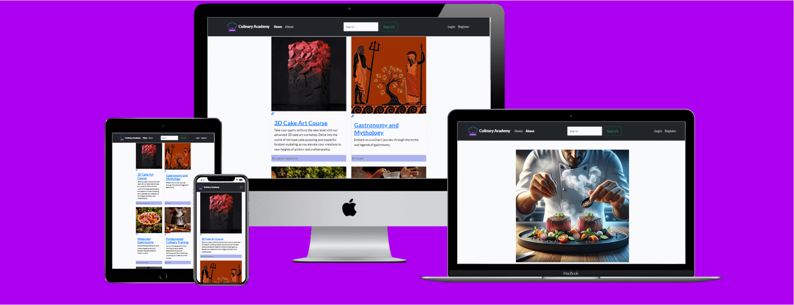
____

## Existing Features
 
### Navigation Bar
- The fully responsive navigation bar on all pages contains links to the Home Page, About Us, search button, register, login pages and is located on each page to allow easy navigation.

- This section will allow the user to easily navigate from page to page on all devices without having to go back to the previous page via the 'back' button.

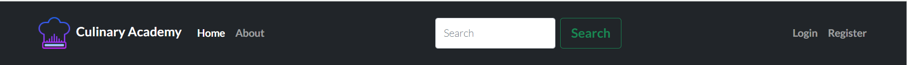
____
## The Landing Page Image
- The homepage of Culinary Academy features basic course information along with images highlighting the company's areas of expertise. When a user clicks on a course URL, they are directed to a page providing detailed information about the course. Additionally, on this page, users can add and delete comments about the course, allowing for interactive engagement. 
- The visual elements effectively emphasize the firm's specialization areas, creating an engaging and informative experience for visitors.

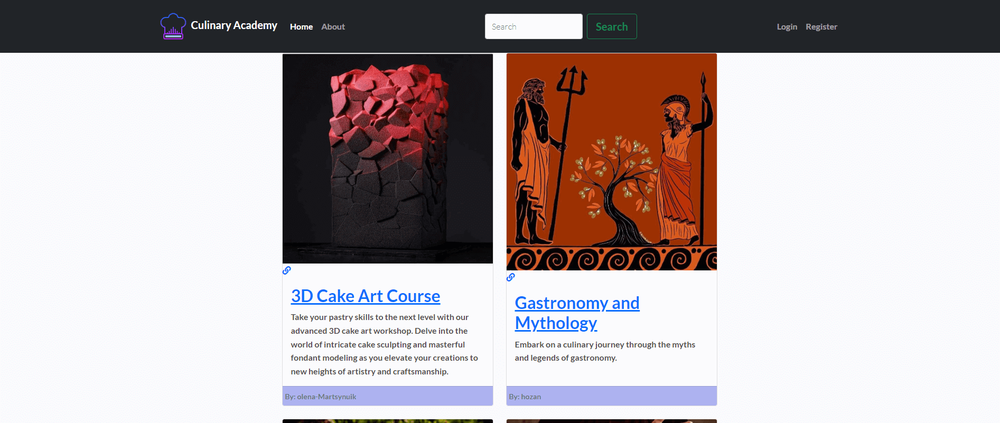

### ABOUT 
- About Us section provides comprehensive details about the culinary courses and services offered by Culinary Academy. Each course is elaborated with further information to help clients understand the curriculum better. Moreover, visitors can explore the profiles of the academy's instructors, learning about their expertise and backgrounds. 
- For those seeking additional information, a contact form is available at the bottom of the page to facilitate further inquiries.
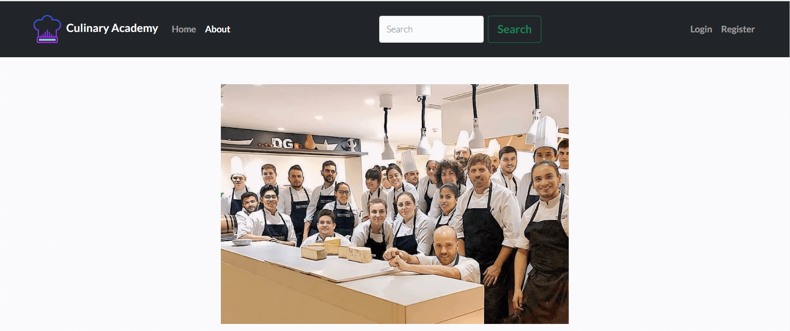
____

____
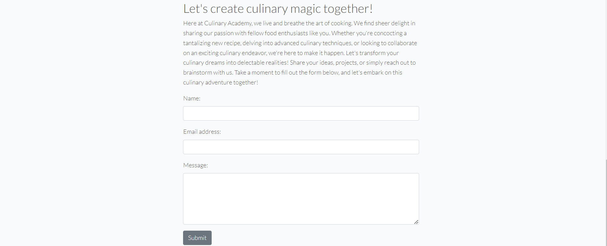
____
 ### The Footer
 - The footer section of Culinary Academy's website features links to its relevant social media platforms, allowing users to easily connect and stay updated. These links are designed to open in a new tab, ensuring seamless navigation for the users. 
 - Additionally, the footer provides essential information such as the academy's working hours, enabling visitors to plan their interactions accordingly. 
 - Alongside the working hours, social media icons are prominently displayed, encouraging users to engage with the academy's content across various platforms.

____
### Search
- "Search Section": On the Culinary Academy website, there is a search button in the header that allows users to easily find the content or courses they are looking for by entering keywords. Users can input keywords to perform a search. If search results are found, users can quickly access the results. However, if no results are found, users are notified with a message indicating that no results were found. This ensures a user-friendly experience.
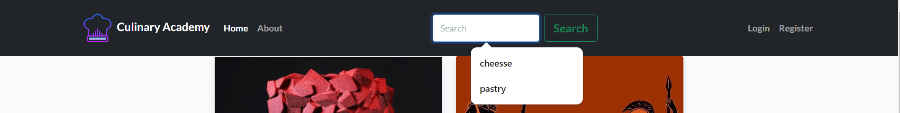
____
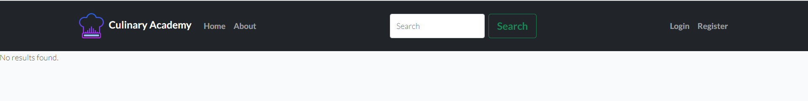
____
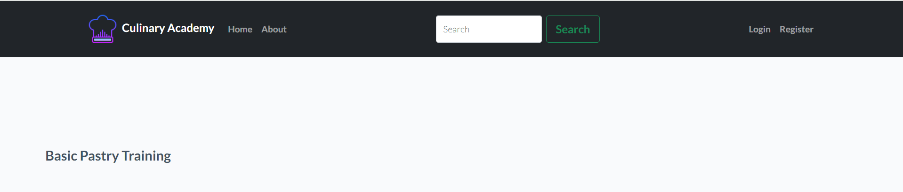

____
### Register
- Registering for Culinary Academy is quite easy! Here, they can take advantage of many benefits by creating a personalized account. All they need to do is choose a username, provide an email address, and select a strong password. Then, they can create their account and embark on an adventure filled with the world's most delicious dishes. After signing up, they can join various courses, receive special tips from chefs, and explore much more

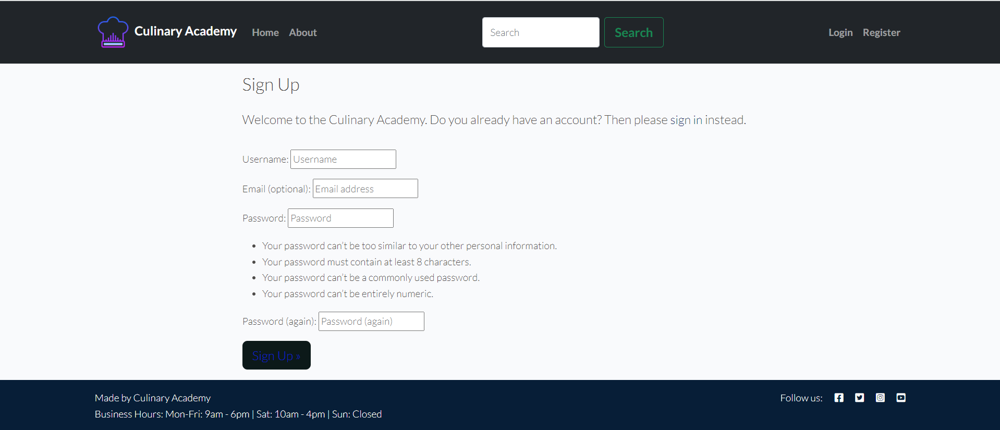

___
### Login
- After logging in, users can browse through comments, leave their own feedback, and explore additional features on the site.

____

## Features Left to Implement
- To integrate a calendar for booking calls
- An application form for the internship programme
- Applying online for the course

____

## Performance For Mobile

### Home page performance

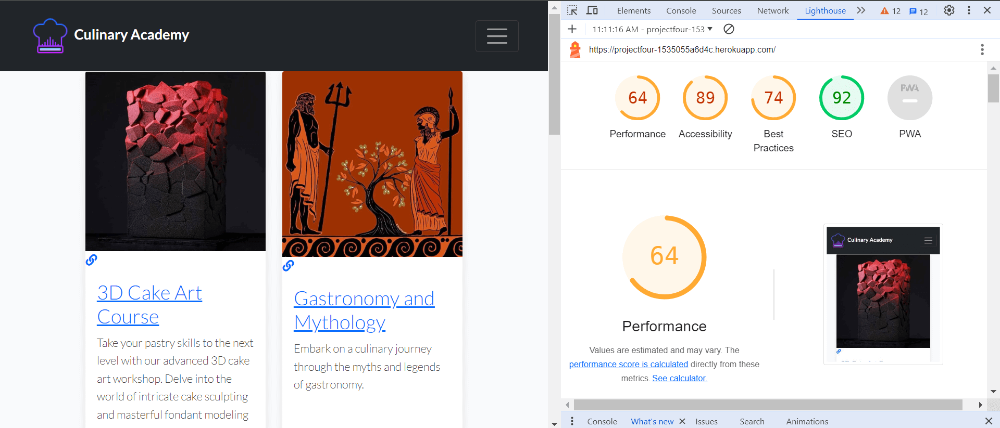
____

### Courses  page performance
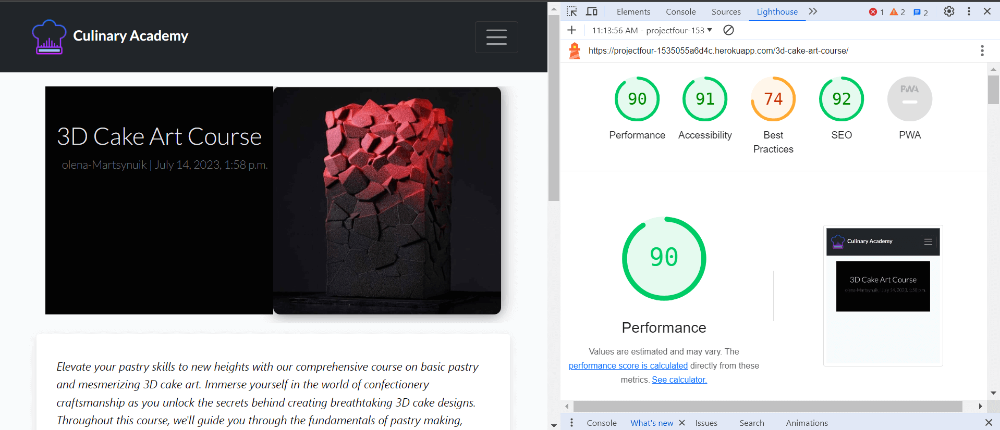
____
### About  page performance

____

### Search page performance

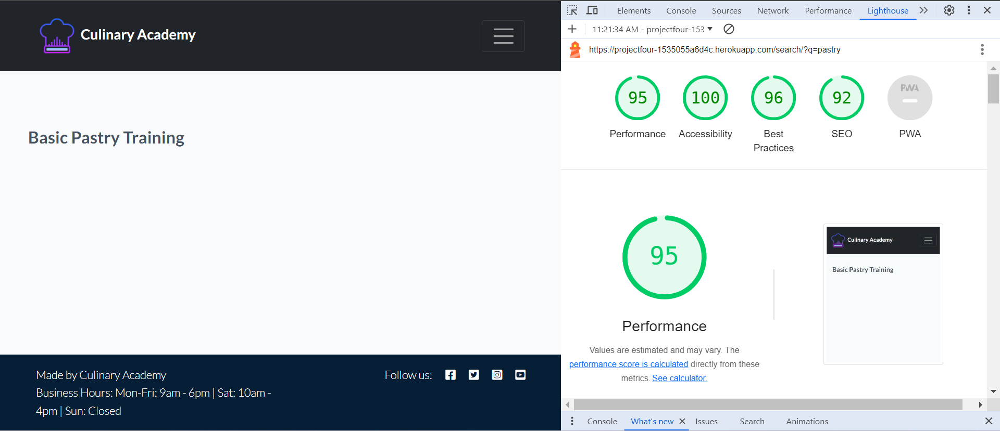
____
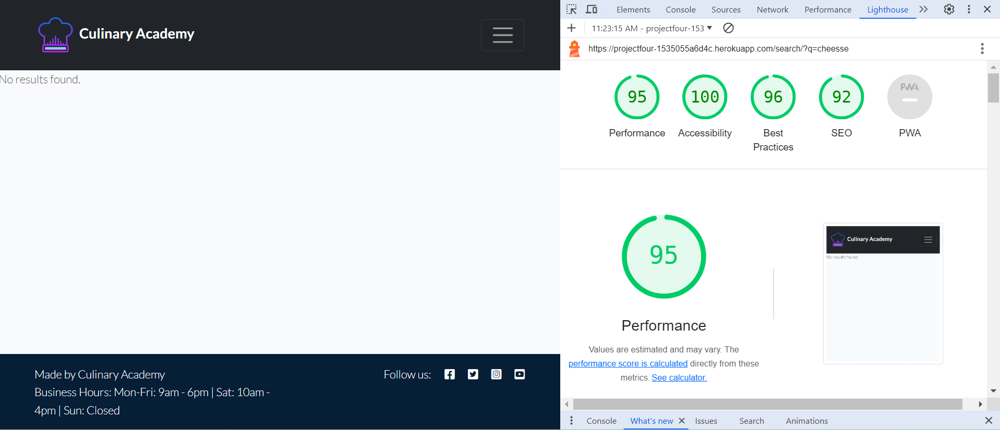
____

### Register page performance

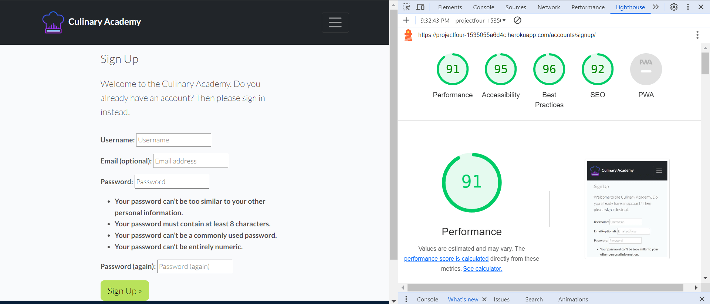
____
### Login page performance

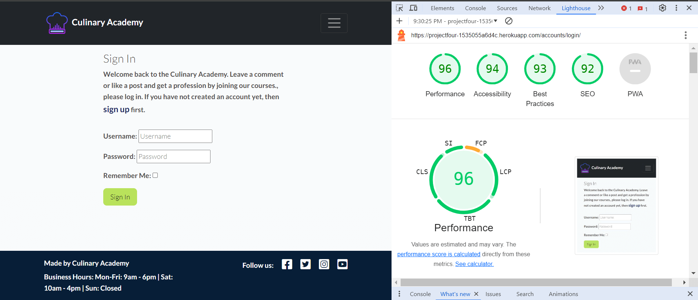
____
### Logout page performance

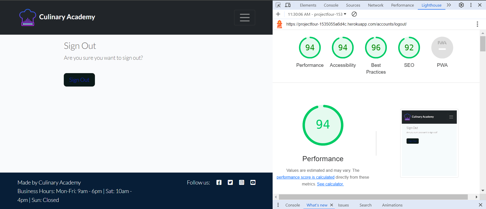
____

## Performance For Desktop

### Home page performance

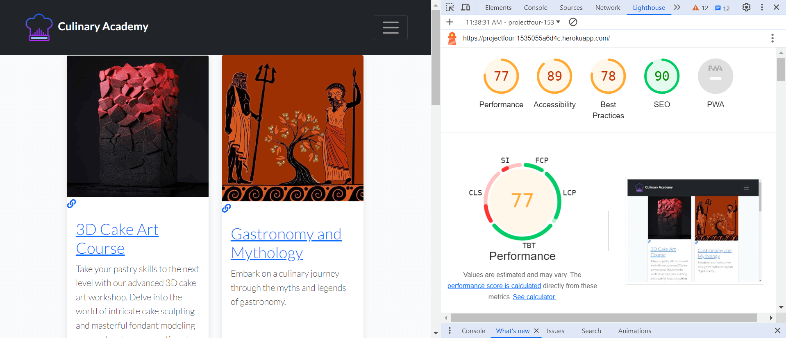
____
### Courses  page performance
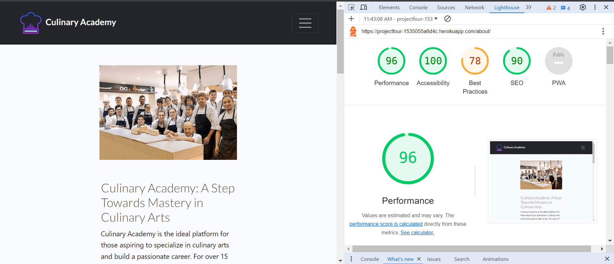
____

### About  page performance
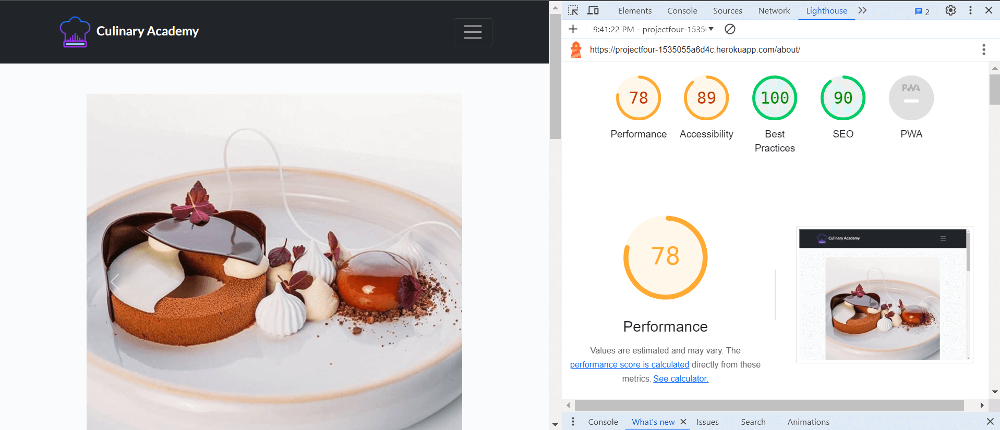

____

### Search page performance

____
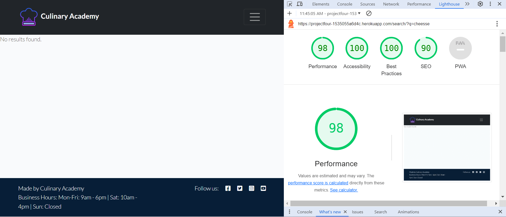
____

### Register page performance

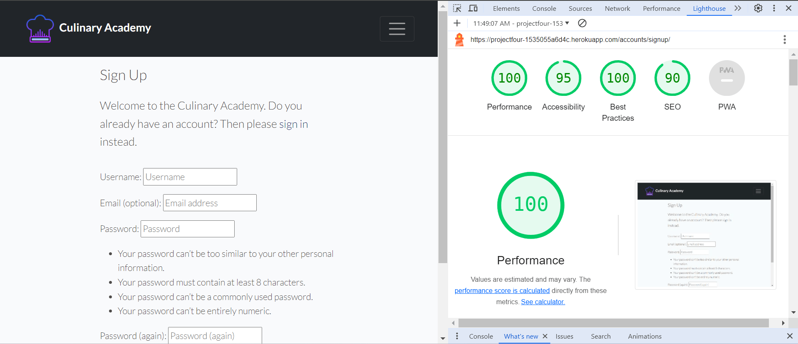
____

### Login page performance

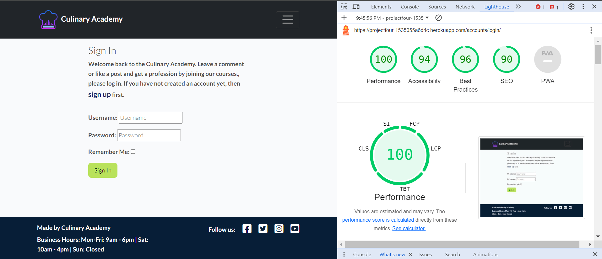
____
### Logout page performance

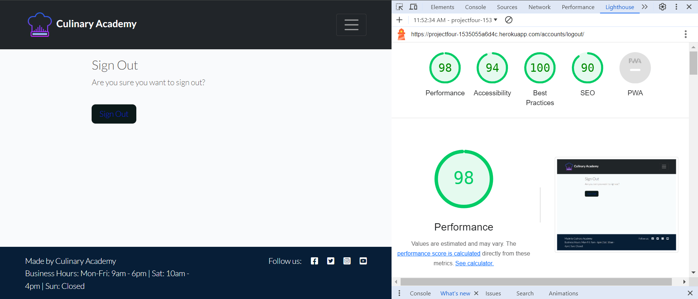
____

## Validator Testing
- HTML: No errors were found when passing through the official [W3C validator](https://validator.w3.org/nu/?doc=https%3A%2F%2Fprojectfour-1535055a6d4c.herokuapp.com%2F)
 - CSS: No errors found when passing through the official [(Jigsaw) validator
Deployment](https://jigsaw.w3.org/css-validator/validator?uri=https%3A%2F%2Fprojectfour-1535055a6d4c.herokuapp.com%2F&profile=css3svg&usermedium=all&warning=1&vextwarning=&lang=en)
____
## Deployment

The site was deployed to  Heroku pages. 

    + [Local Deployment](#local-deployment)
    + [Heroku Deployment](#heroku-deployment)-
    + [django-aullauth Setup](#django-aullauth-setup)
    + [cloudinary Setup](#cloudinary-Setup)
    + [ElephantSQL Setup](#ElephantSQL-Setup)

- The live link for Heroku can be found here - https://projectfour-1535055a6d4c.herokuapp.com/
   
____
## Credits

### Content
-  Instructions on how to apply form verification on the Register page are taken from 
[Btkakademi](https://www.btkakademi.gov.tr)
___
### Media
- Images used on homepage and registration page are taken from [instagram](https://www.instagram.com/)

- The image used for the About Us page was taken from[instagram](https://www.instagram.com/)
  
- The image used for the return page was taken from the website [instagram](https://www.instagram.com/)

- Favicon was downloaded at [Icons8](https://icons8.com/icons/set/book)

- Icons in the Login taken from
[Font Awesome](https://fontawesome.com)

- Icons in the footer taken from
[Font Awesome](https://fontawesome.com)